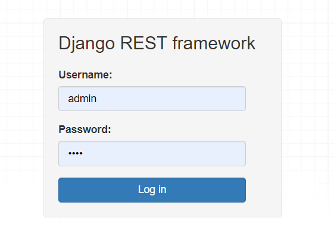
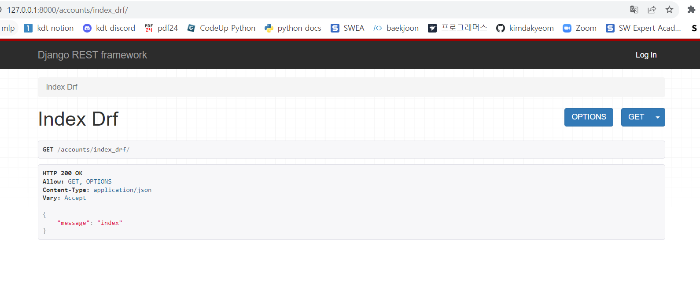

# Django REST Framework 1회차
## REST를 써야하는 이유
- Django로 프론트와 백을 나누어 협업을 할 경우, 프론트 담당자 입장에서 Django의 시스템에 대해 이해가 부족하다면 작업하기가 힘들다.
- React 등을 이용하여 개발하기 힘들어서 웹의 프론트 퀄리티도 높이기 힘들다.
- rest는 웹 브라우저 뿐 아니라 모바일(안드로이드, ios 등) 등 멀티플랫폼에도 대응할 수 있다.

## REST의 특징
> REpresentational State Transfer
- HTTP 프로토콜을 사용한다.
- 자원 관리(resource management)가 편리하다.
- 플랫폼에 독립적이다.

## REST의 예시
- 프로필 페이지를 만든다면 URL은 다음과 같다.

Profile **LIST** `<protocol>://<HOST domain>/api/v1/profiles` HTTP **GET**

Profile **CREATE** `<protocol>://<HOST domain>/api/v1/profiles` HTTP **POST**

Profile **GET** `<protocol>://<HOST domain>/api/v1/profiles/<profile_id>` HTTP **GET**

Profile **UPDATE** `<protocol>://<HOST domain>/api/v1/profiles/<profile_id>` HTTP **PUT/PATCH**

Profile **DELETE** `<protocol>://<HOST domain>/api/v1/profiles/<profile_id>` HTTP **DELETE**

- 만약 유저의 프로필을 가져온다면

Profile **GET** `http://onion.haus/api/v1/profiles/632` HTTP **GET**

- 아래 RESPONSE JSON 형태로 정보를 가져와 클라이언트와 서버가 통신한다.

```
{
    "id": "632",
    "image": "test_image_5232.jpg",
    "nickname": "HELLO_WORLD"
}
```

## rest api 시작하기
### installation
- 새로운 프로젝트 만든후
- 터미널 명령으로 라이브러리 설치하기
```bash
$ pip install djangorestframework markdown
```

- settings.py에 세팅하기
```python
# pjt/settings.py

INSTALLED_APPS = [
    ...
    'rest_framework',
]
```

- 브라우저를 통해 api를 테스트하고자 할 때 인증을 위해 urls.py에 추가하기
```python
urlpatterns = [
    ...
    path('api-auth/', include('rest_framework.urls'))
]
```

- 런서버 후 rest framework가 제공하는 인증 페이지로 이동하기
  - `http://127.0.0.1:8000/api-auth/login/`



## view
### 기존 django view
- urls.py
```python
from django.urls import path
from . import views

app_name = "accounts"

urlpatterns = [
    path('index/', views.index)
]
```

- views.py
```python
from django.http import HttpResponse

def index(request):
    return HttpResponse('index')
```


### django rest view
- urls.py
```python
from django.urls import path
from . import views

app_name = "accounts"

urlpatterns = [
    path('index_drf/', views.index_drf)
]
```
- views.py
```python
from rest_framework.decorators import api_view
from rest_framework.response import Response

@api_view()
def index_drf(request):
    return Response({"message": "index"})
```

- json 형태로 잘 넘어간 것을 확인할 수 있다.

