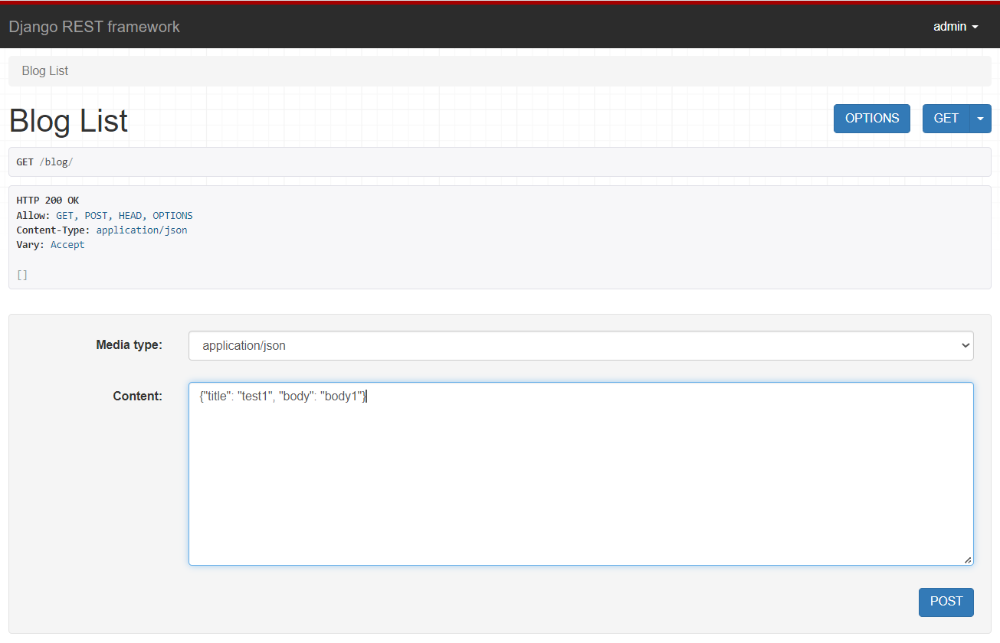
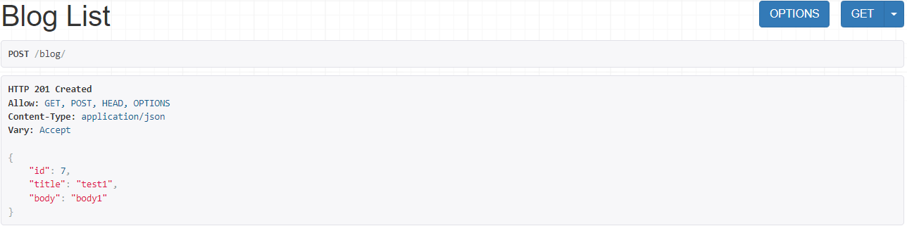
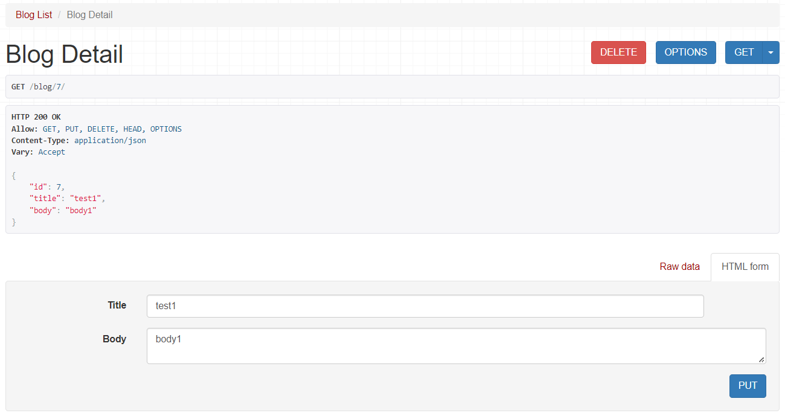
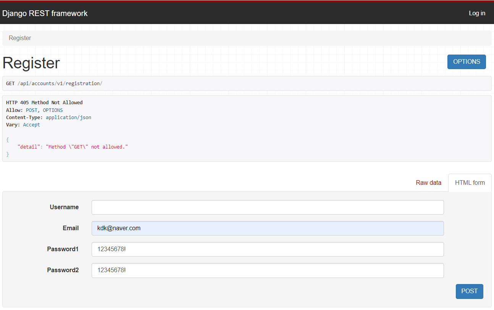
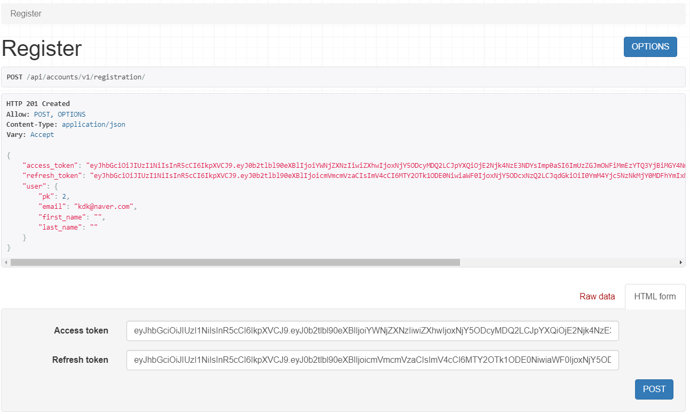
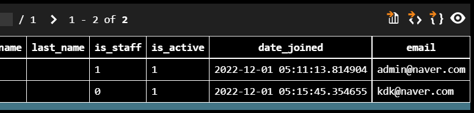
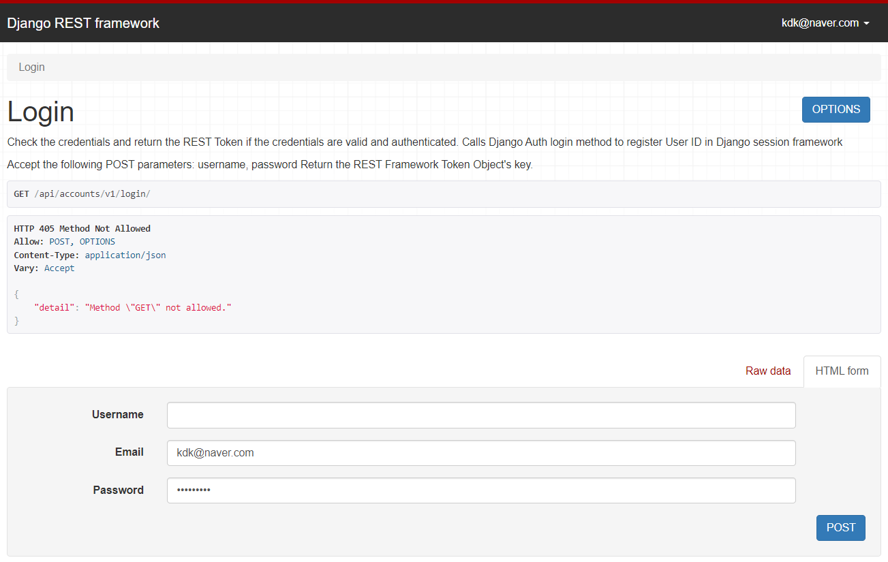
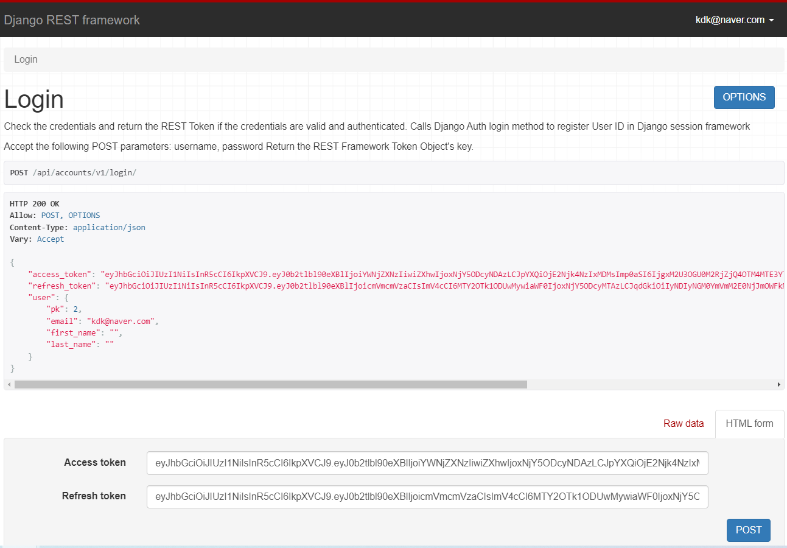

# Django REST Framework 2회차
## 게시판 + 로그인/회원가입 + 인증

## Serializer
- django에서 활용되는 form과 매우 유사한 개념
  - form : HTML form 생성
  - serializer : JSON 문자열 생성
- Django Rest Framework에서는 serializer를 통해 client의 입력 데이터를 직렬화하여 전달

## APIView
- 원하는 HTTP method를 커스터마이징 할 수 있다는 장점이 있다.

[DRF APIView 공식문서](https://www.django-rest-framework.org/tutorial/3-class-based-views/)

### models.py
- 게시판 기능을 위해 title, body라는 field 생성
```python
from django.db import models
from django.conf import settings

class Blog(models.Model):
    title = models.CharField(max_length=100)
    body = models.TextField()
```

### serializers.py
- fields를 `__all__`로 설정해서 Blog의 title과 body 모두 직렬화
```python
from .models import Blog
from rest_framework import serializers

class BlogSerializer(serializers.ModelSerializer):
    class Meta:
        model = Blog
        fields = '__all__'
```

### views.py
- Blog 전체 목록을 보여주는 역할을 하는 BlogList 클래스 : 2가지 HTTP method
  - 전체 목록 보여주기 (GET)
  - 새로운 Blog 객체 등록하기 (POST)
- Blog 객체의 detail을 보여주는 BlogDetail 클래스 : 3가지 HTTP method
  - Blog 객체의 detail 보여주기 (GET)
  - Blog 객체 수정하기 (PUT)
  - Blog 객체 삭제하기 (DELETE)

```python
# 데이터 처리
from .models import Blog
from .serializers import BlogSerializer

# APIView를 사용하기 위해 import
from rest_framework.views import APIView
from rest_framework.response import Response
from rest_framework import status
from django.http import Http404

# Blog의 목록
class BlogList(APIView):
    # Blog list를 보여줄 때
    def get(self, request):
        blogs = Blog.objects.all()
        # 여러 개의 객체를 serialization하기 위해 many=True로 설정
        serializer = BlogSerializer(blogs, many=True)
        return Response(serializer.data)

    # 새로운 Blog 글을 작성할 때
    def post(self, request):
        # request.data는 사용자의 입력 데이터
        serializer = BlogSerializer(data=request.data)
        if serializer.is_valid(): #유효성 검사
            serializer.save() # 저장
            return Response(serializer.data, status=status.HTTP_201_CREATED)
        return Response(serializer.errors, status=status.HTTP_400_BAD_REQUEST)

# Blog의 detail
class BlogDetail(APIView):
    # Blog 객체 가져오기
    def get_object(self, pk):
        try:
            return Blog.objects.get(pk=pk)
        except Blog.DoesNotExist:
            raise Http404
    
    # Blog의 detail 보기
    def get(self, request, pk, format=None):
        blog = self.get_object(pk)
        serializer = BlogSerializer(blog)
        return Response(serializer.data)

    # Blog 수정하기
    def put(self, request, pk, format=None):
        blog = self.get_object(pk)
        serializer = BlogSerializer(blog, data=request.data) 
        if serializer.is_valid():
            serializer.save()
            return Response(serializer.data) 
        return Response(serializer.errors, status=status.HTTP_400_BAD_REQUEST)

    # Blog 삭제하기
    def delete(self, request, pk, format=None):
        blog = self.get_object(pk)
        blog.delete()
        return Response(status=status.HTTP_204_NO_CONTENT)    
```

### urls.py
- 앱 단위의 urls.py
```python
from django.urls import path
from rest_framework.urlpatterns import format_suffix_patterns
from . import views

urlpatterns =[
    path('blog/', views.BlogList.as_view()),
    path('blog/<int:pk>/', views.BlogDetail.as_view()),
]

urlpatterns = format_suffix_patterns(urlpatterns)
```

- 프로젝트 단위의 urls.py
```python
from django.contrib import admin
from django.urls import path, include

urlpatterns = [
    path('admin/', admin.site.urls),
    path('', include('blog.urls')),
]
```

### 마이그레이션 후 런서버
- `http://127.0.0.1:8000/blog/`
  - blog 페이지 접속
  - 위에는 Blog 객체를 보여주는 GET 방식
  - 아래에는 Blog 객체를 등록할 수 있는 POST 방식





- `http://127.0.0.1:8000/blog/<int:pk>`
  - blog의 detail 정보 확인 (GET)
  - 아래에 PUT을 통해 내용을 수정
  - DELETE를 통해 해당 객체 삭제



> APIView를 통해 views.py를 작성하다보면 각 클래스마다 필요한 method 함수를 계속 작성하다보니 특정 함수를 계속 반복하고 코드가 길어진다. mixins 방식으로 코드를 더욱 줄일 수 있다.

## JWT로 로그인 및 회원가입
## 회원가입

### 앱 추가
```python
NSTALLED_APPS = [
    'django.contrib.admin',
    'django.contrib.auth',
    'django.contrib.contenttypes',
    'django.contrib.sessions',
    'django.contrib.messages',
    'django.contrib.staticfiles',
    # 새로 추가한 앱
    'accounts',
]
```
### accounts/managers.py 추가
- 일반 유저를 만들때와 슈퍼 유저를 만들떼 함수 작성
```python
from django.contrib.auth.base_user import BaseUserManager
from django.utils.translation import gettext_lazy as _

class UserManager(BaseUserManager):
    def create_user(self, email, password, **extra_fields):
        if not email:
            raise ValueError(_('The Email must be set'))
        email = self.normalize_email(email)
        user = self.model(email=email, **extra_fields)
        user.set_password(password)
        user.save()
        return user

    def create_superuser(self, email, password, **extra_fields):
        extra_fields.setdefault('is_staff', True)
        extra_fields.setdefault('is_superuser', True)
        extra_fields.setdefault('is_active', True)

        if extra_fields.get('is_staff') is not True:
            raise ValueError(_('Superuser must have is_staff=True.'))
        if extra_fields.get('is_superuser') is not True:
            raise ValueError(_('Superuser must have is_superuser=True.'))
        return self.create_user(email, password, **extra_fields)
```

### accounts/models.py 에 Custom User 추가
- Project 중간에 User Model을 건드리기는 매우 힘들기때문에 Custome User를 프로젝트 시작 전에 만들어야한다.
- email로 로그인 및 계정 생성 가능
```python
from django.contrib.auth.models import AbstractUser
from django.db import models
from django.utils.translation import gettext_lazy as _

from .managers import UserManager

class User(AbstractUser):
    username = None
    email = models.EmailField(_('email address'), unique=True)

    USERNAME_FIELD = 'email'
    REQUIRED_FIELDS = []

    objects = UserManager()

    def __str__(self):
        return self.email
```
### api/settings.py 사용할 User 모델 선언
```python
AUTH_USER_MODEL = 'accounts.User'
```
### makemigrations, migrate

## 라이브러리를 활용하여 회원가입 구현하기
- djangorestframework : Django를 rest api 형태로 사용할 수 있도록 도와준다.
- dj-rest-auth : REST API 형태로 제공해주는 로그인, 비밀번호 찾기 등의 기능을 제공한다. django-rest-auth는 업데이트가 종료되어서 해당 라이브러리를 사용한다.
- django-allauth: 회원가입 기능을 제공한다.
- djangorestframework-simplejwt: Django에서 JWT Token을 사용하도록 도와준다.
### 라이브러리 설치
```bash
pip install djangorestframework dj-rest-auth django-allauth djangorestframework-simplejwt
```

### api/settings.py 에 새로 설치한 앱(Package) 추가
```python
INSTALLED_APPS = [
    'django.contrib.admin',
    'django.contrib.auth',
    'django.contrib.contenttypes',
    'django.contrib.sessions',
    'django.contrib.messages',
    'django.contrib.staticfiles',
    # 새로 추가한 앱
    'accounts',
    # 설치한 라이브러리들
    'rest_framework',
    'rest_framework.authtoken',
    'dj_rest_auth',
    'django.contrib.sites',
    'allauth',
    'allauth.account',
    'allauth.socialaccount',
    'dj_rest_auth.registration',
]

REST_USE_JWT = True
JWT_AUTH_COOKIE = 'my-app-auth'
JWT_AUTH_REFRESH_COOKIE = 'my-refresh-token'

SITE_ID = 1
ACCOUNT_UNIQUE_EMAIL = True
ACCOUNT_USER_MODEL_USERNAME_FIELD = None
ACCOUNT_USERNAME_REQUIRED = False
ACCOUNT_EMAIL_REQUIRED = True
ACCOUNT_AUTHENTICATION_METHOD = 'email'
ACCOUNT_EMAIL_VERIFICATION = 'none'
```

#### 변수 목록
- dj-rest-auth
  - REST_USE_JWT: JWT 사용 여부
  - JWT_AUTH_COOKIE: 호출할 Cookie Key값
  - JWT_AUTH_REFRESH_COOKIE: Refresh Token Cookie Key 값 (사용하는 경우)

- django-allauth
  - SITE_ID: 해당 도메인의 id (django_site 테이블의 id, oauth 글에서 다룰 예정)
  - ACCOUNT_UNIQUE_EMAIL: User email unique 사용 여부
  - ACCOUNT_USER_MODEL_USERNAME_FIELD: User username type
  - ACCOUNT_USERNAME_REQUIRED: User username 필수 여부
  - ACCOUNT_EMAIL_REQUIRED: User email 필수 여부
  - ACCOUNT_AUTHENTICATION_METHOD: 로그인 인증 수단
  - ACCOUNT_EMAIL_VERIFICATION: Email 인증 필수 여부

### migrate

### accounts/urls.py 추가
- urls에 회원가입을 할 수 있도록 추가한다.
```python
from django.urls import path, include

urlpatterns = [
    path('registration/', include('dj_rest_auth.registration.urls')),
]
```
### pjt/urls.py 추가
```python
from django.contrib import admin
from django.urls import path, include

urlpatterns = [
    path('admin/', admin.site.urls),
    path('api/accounts/v1/', include('accounts.urls')),
]
```

### 런서버
- `http://127.0.0.1:8000/api/accounts/v1/registration/` 에 접속



- 회원 정보를 post 하면 access_token, refresh_token을 발급해주고 db에도 잘 저장된 것을 볼 수 있다.




## 로그인
### accounts/urls.py
```python
from django.urls import path, include

urlpatterns = [
    path('', include('dj_rest_auth.urls')), # 해당 라인 추가
    path('registration/', include('dj_rest_auth.registration.urls')),
]
```
- 아래의 url 모두 사용 가능
```python
http://localhost:8000/api/accounts/v1/password/reset/
http://localhost:8000/api/accounts/v1/password/reset/confirm/
http://localhost:8000/api/accounts/v1/login/
http://localhost:8000/api/accounts/v1/logout/
http://localhost:8000/api/accounts/v1/user/
http://localhost:8000/api/accounts/v1/password/change/
http://localhost:8000/api/accounts/v1/token/verify/
http://localhost:8000/api/accounts/v1/token/refresh/
```

### 런서버
- `http://127.0.0.1:8000/api/accounts/v1/login/` 에 접속



- 회원 정보를 post 하면 access_token, refresh_token을 발급해주고 db에도 잘 저장된 것을 볼 수 있다.

