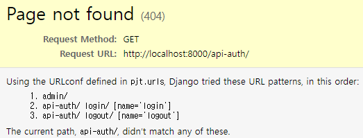

## DRF Study

- 작성자: 김현정


##### 📌 DRF란?

- Django Rest Framework

- 왜 DRF를 사용하는지? Web을 넘어서서 Android 등의 다양한 플랫폼에서 templates를 보여주기 위함


##### 📌DRF의 기본 설정

- pip 패키지 설치

  - django==3.2.13
  - djangorestframework

- pjt/settings.py 설정

  ```python
  # pjt/settings.py
  ...
  INSTALLED_APPS = [
      ...
      'rest_framework',
  ]
  ```

- pjt/urls.py 설정

  ```python
  # pjt/urls.py
  ...
  from django.urls import path, include
  
  urlpatterns = [
      ...
      path('api-auth/', include('rest_framework.urls')),
  ]
  ```


##### 📌기본 설정 후 runserver

- pjt/urls.py에서 작성했던대로, localhost:8000/api-auth를 접근해보면 다음과 같은 404 에러가 출력됨

  

- api-auth 하위에 login, logout을 제공해준다는 것을 에러페이지에서 확인할 수 있음.


##### 📌 MVC 개요

- Model - View - Controller가 기본적인 형태이나 django는 Model - View - ~~Controller~~Template임!
- DRF는 **Model, View**를 집중적으로 설정하고 제어함
- Model이 하는 역할?
  - django의 Model이 DB와 연결을 해줌
  - 이를 ORM(Object Relational Mapping)이 제어해줌 - SQL을 굳이 사용하지 않아도 무방!
- View이 하는 역할?
  - 어떠한 작업을 해주는 일종의 Controller
  - 사용자의 Request를 처리해서 Response를 해주는 역할!
- Template이 하는 역할?
  - JavaScript, HTML, CSS로 시각화하여 웹을 보여줌


##### 📌 라우팅(Routing)

- 말 그대로 어딘가를 연결해주는 것.

- django에서 Routing을 어떻게 하느냐?

  - 예를 들어 MainApp에서 AccountsApp으로 넘어가도록 제어하기 위한 파일은? 각 app 내의 urls.py!

    - django는 MainApp이라는 것을 보통 프로젝트로 인식하고 거기서 다시 하위 App을 들어가게 되는데,
      이 MainApp, 즉, startproject로 생성한 파일을 어떻게 인식하느냐? settings.py ROOT_URL_CONF에 답이 있음.

      ```python
      # pjt/settings.py
      ...
      ROOT_URLCONF = 'pjt.urls'
      ...
      ```

- AccountsApp을 생성하여 views.py에서 다음과 같은 함수를 정의 후 실행하면 DRF 화면이 출력됨

  ```python
  # accountsApp/views.py
  ...
  from rest_framework.response import Response
  from rest_framework.decorators import api_view
  
  @api_view
  def hello_world_drf(request):
      return Response({'message': 'Hello_world'})
  ```

  

##### 📌 Flutter

- Google에서 개발한 플랫폼 모바일 앱 개발 프레임워크
- 공식홈페이지
  - https://flutter.dev/?gclid=Cj0KCQiA1ZGcBhCoARIsAGQ0kkqBLkaedxR1FR23qG4_CCLqtkvbxXtE9dOX8xnbNxOGtkXKEf7FqxcaAj8MEALw_wcB&gclsrc=aw.ds


##### 📌CRUD 구현

- 출처: https://wisdom-990629.tistory.com/entry/DRF-ViewSet%EC%9C%BC%EB%A1%9C-CRUD-%EA%B5%AC%ED%98%84%ED%95%98%EA%B8%B0
  1. models.py에 모델 정의
  2. serializers.py에 Model처럼 serializers를 상속받은 클래스 정의
  3. views.py에 쿼리셋과 정의한 serializer 클래스를 담는 변수 정의
  4. urls.py에 as_view() 함수와 router를 이용하여 서로다른 path 함수를 하나로 묶어줌
- 해당 출처를 통해 CRUD를 어설프게나마 구현해본후 깨달은 내역은, json을 통해 데이터를 처리하고 이 json으로 나열된 데이터를 serializer로 직렬화하고 serializer에서 제공하는 CRUD 관련 함수를 활용하여 urls.py에서 return 값을 정의해주고 서로다른 path를 묶어주면 됨.
  - 즉, views.py가 너무나도 간단해짐!
  - DRF를 사용함으로써 json 데이터 처리하기가 용이해지고, 이 json 데이터를 처리하기 위해 serializer라는 개념이 등장하였으며, 이 serializer에서 제공하는 기본 내장 함수를 통해 views.py에서 일일이 CRUD를 정의하지 않아도 됨!