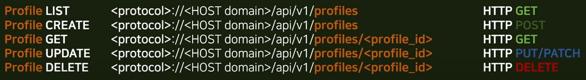
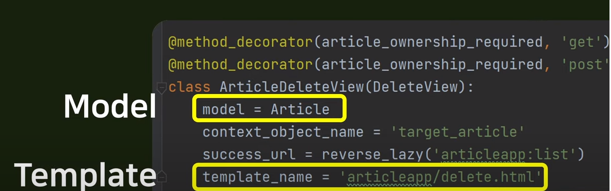
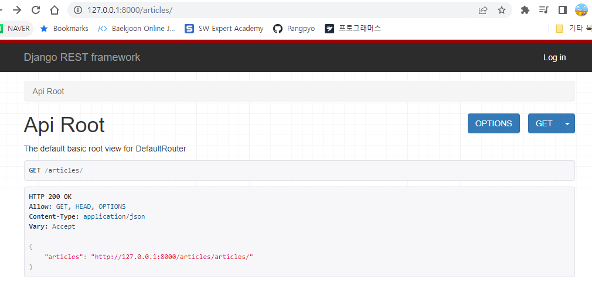
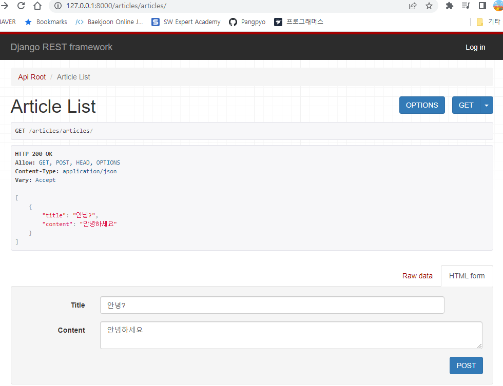
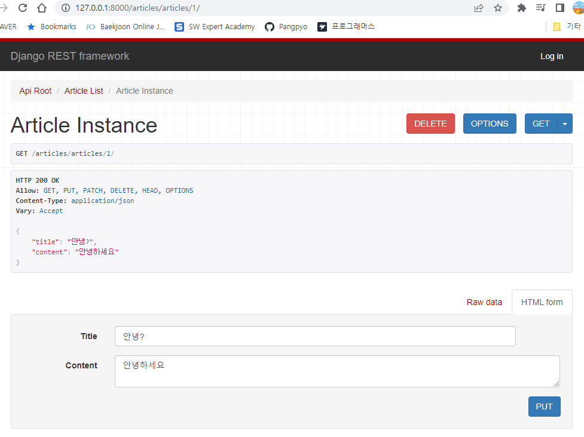

# DRF STUDY 1회차

## REST?

* REST : Representational State Transfer
  * HTTP protocol을 사용한다
  * 자원 관리가 편리하다
  * 플랫폼에 종속되지 않는다
  * 
  * 이전과 같이 url로 기능을 분리하는것이 아닌, url을 고정시키고 HTTP 메서드를 통해 자원 관리를 한다.
  * HTTP 메서드를 사용하는 모든 플랫폼에서 사용 가능하다.
* 기존 장고와의 차이?
  * 
  * 기존 장고는 view와 template이 강하게 결합되어있다.
  * 웹만 만든다면 괜찮다. 하지만 모바일 어플리케이션에 대응하지 못한다.
  * 이에 대응하기위해 REST를 사용한다.

## Django rest framework 설치

* 장고 설치 후, 

```bash
pip install djangorestframework
pip install markdown 
```

```python
# settings.py

INSTALLED_APPS = [
    ...
    'rest_framework',
]
```

```python
urls.py

urlpatterns = [
    ...
    path('api-auth/', include('rest_framework.urls'))
]
```

## Article 만들어보기(viewset)

```python
# models.py
from django.db import models

class Article(models.Model):
    title = models.CharField(max_length=50)
    content = models.TextField()
    created_at = models.DateTimeField(auto_now_add=True)

    def __str__(self):
        return self.title

# serializers.py

from rest_framework import serializers
from articles.models import Article

class ArticleSerializer(serializers.ModelSerializer):
    class Meta:
        model = Article
        fields = (
            "title",
            "content",
        )

# urls.py

from django.urls import path, include
from rest_framework import routers
from . import views

router = routers.DefaultRouter()
router.register("articles", views.ArticleViewSet)

app_name = "articles"

urlpatterns = [path("", include(router.urls))]


# views.py

from .serializers import ArticleSerializer
from rest_framework import viewsets
from .models import Article


# Create your views here.


class ArticleViewSet(viewsets.ModelViewSet):
    queryset = Article.objects.all()
    serializer_class = ArticleSerializer


```

runserver 한 후 해당 url로 이동하면?



이러한 화면이 뜨게된다.

url을 클릭해 이동하면



글 작성이 가능하다.



`articles/articles/<pk>`로 이동하면 디테일 페이지를 확인 가능하며, DELETE를 통해 삭제, PUT을 통해 수정이 가능하다.