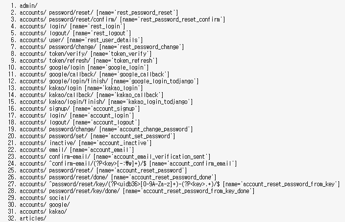
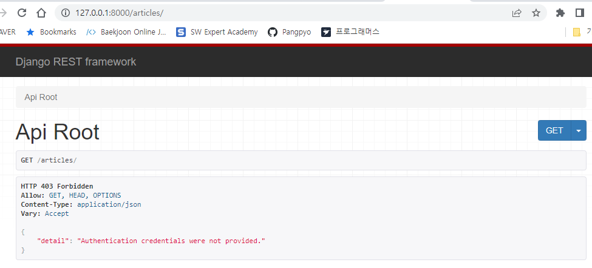
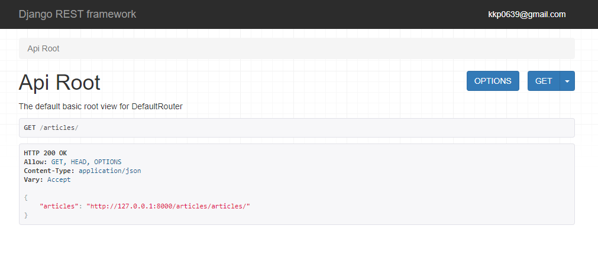

# DRF STUDY 2회차

## 유저 인증

### 세션, 쿠키

* Session
  * 서버에서 가지고있는 **정보**
* Cookie
  - 서버에서 발급된 세션을 열기 위한 **키** 값(세션 ID 라고 칭함)

쿠키만으로 인증을 한다는 것은서버의 자원은 사용하지 않는다는 것 - 클라이언트가 인증 정보를 책임지는 것을 의미합니다.

쿠키만으로 인증을 할 경우, 해커가 HTTP 요청을 중간에서 뺏어갈 때, **모든 정보가 탈취됩니다**.
또한 쿠키는 조작된 데이터일 수 있으므로 실제 정보가 존재하는 database 를 사용해서 작업합니다.
따라서 보안과는 관련 없는 장바구니, 자동로그인 설정 같은 경우에 유용하게 사용됩니다.

인증의 책임을 서버가 지게 하기 위해서 세션을 함께 사용합니다. **사용자는 쿠키를 이용하고, 서버에서는 쿠키를 받아 세션의 정보를 접근하는 방식으로 인증**을 합니다.

### 토큰(Token)

* 토큰 기반 인증이란 사용자가 자신의 아이덴티티를 확인하고 고유한 [액세스 토큰](https://www.okta.com/identity-101/access-token/)을 받을 수 있는 프로토콜을 말합니다. 사용자는 토큰 유효 기간 동안 동일한 웹페이지나 앱, 혹은 그 밖에 해당 토큰으로 보호를 받는 리소스로 돌아갈 때마다 자격 증명을 다시 입력할 필요 없이 토큰이 발급된 웹사이트나 앱에 액세스할 수 있습니다.

* JWT (JSON Web Token) 는 인증에 필요한 정보들을 암호화시킨 토큰을 의미합니다. 위의 세션/쿠키 방식과 유사하게 사용자는 Access Token (JWT Token) 을 HTTP 헤더에 실어 서버에 전송합니다. 토큰은 **임의로 생성된 비밀번호** 같이 동작합니다. 제한된 수명을 가지고, 새로운 토큰은 한번 만료되면 새로 생성되어야합니다.(Refresh Token)

## JWT인증을 사용한 회원가입&로그인

### dj-rest-auth를 사용해서 회원가입을 구현해본다.

djangorestframework-simplejwt, dj-rest-auth, allauth를 설치한다.

이후 [참고링크](https://velog.io/@kjyeon1101/dj-rest-auth%EB%A5%BC-%ED%99%9C%EC%9A%A9%ED%95%9C-%EC%95%84%EC%A3%BC-%EA%B0%84%ED%8E%B8%ED%95%9C-JWT-%ED%9A%8C%EC%9B%90%EA%B0%80%EC%9E%85%EB%A1%9C%EA%B7%B8%EC%9D%B8)의 과정을 따라가면, restframwork 화면에서 



위와 같은 url들이 추가 된 것을 볼 수 있다. 

accounts/login/ 에서 로그인, 

accounts/logout/ 에서 로그아웃, 

accounts/signup/ 에서 회원가입을 할 수 있다.

accounts/google, accounts/kakao url에서 소셜로그인 진행 가능하다.

### 유저-게시글

articles 모델에 user 를 Foreignkey로 추가해준 후, views.py에서 다음과 같은 코드를 추가한다.

```python
# views.py

class ArticleViewSet(viewsets.ModelViewSet):
    ...
    def perform_create(self, serializer):
        serializer.save(user=self.request.user)
```

기존 장고에서 함수형 뷰를 만들때 `article = form.save(commit=False)`를 추가해서 유저를 저장 한 후 다시 저장했던 것과 비슷하게, 여기서도 serializer에서 user값을 지정해준 후 저장해야한다.

```python
# serializers.py

class ArticleSerializer(serializers.ModelSerializer):
    user = serializers.ReadOnlyField(source="user.email")

    class Meta:
        model = Article
        fields = (
            "pk",
            "title",
            "content",
            "user",
        )
```

serializers에서도 user필드를 추가해준다. 또한 readonly필드로 지정해 읽기만 가능하게 한다.

### PERMISSION, AUTHENTICATION

```python
#settings.py

REST_FRAMEWORK = {
    "DEFAULT_PERMISSION_CLASSES": ("rest_framework.permissions.IsAuthenticated",),
    "DEFAULT_AUTHENTICATION_CLASSES": (
        "rest_framework.authentication.SessionAuthentication",
        "dj_rest_auth.jwt_auth.JWTCookieAuthentication",
    ),
}
```

셋팅에서 위와 같이 인증, 권한을 설정했다.



로그인을 하지 않은 상태에서는 열람이 되지 않는 것을 볼 수 있다.



로그인 후에는 위와 같이 글 열람이 가능해진다.
