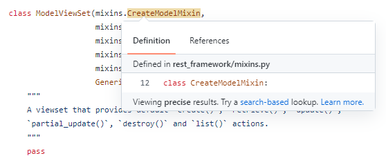
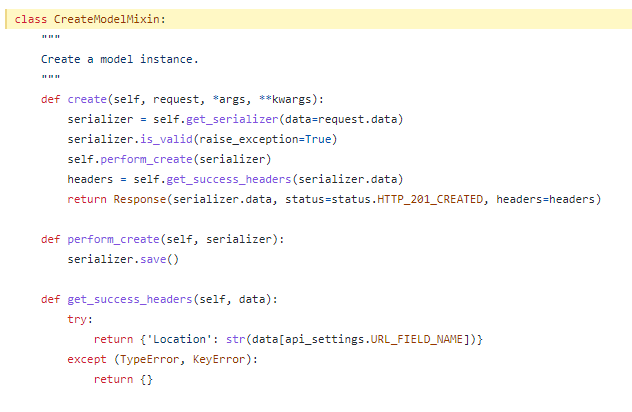
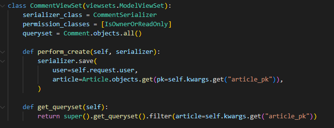

## DRF STUDY 3회차

### 비모강사님의 질문

- 게시글 요청하면 댓글도 같이 응답하려면 어떻게?
  - django serializer relation?

* [공식 문서](https://www.django-rest-framework.org/api-guide/relations/)

* 다양한 유형의 모델 관계를 나타내기 위해 serializer relation을 사용한다.

```python
class CommentSerializer(serializers.ModelSerializer):

    user = serializers.ReadOnlyField(source="user.nickname")
    article = serializers.ReadOnlyField(source="article.pk")
    soncomments = ReCommentSerializer(many=True, read_only=True)
    total_likes = serializers.SerializerMethodField(read_only=True)

    class Meta:
        model = Comment
        fields = [
            "pk",
            "article",
            "user",
            "content",
            "created_at",
            "soncomments",
            "total_likes",
        ]

    def get_total_likes(self, comment):
        return comment.like_comment.count()
```

위의 시리얼라이져에서 나는 3가지의 serializer relation을 사용했다.

* `ReadOnlyField` : `user`와 `article`은 사용자가 직접 입력하는 값이 아니기 때문에 `ReadOnlyField`필드로 두게 된다. 이렇게 하면 POST시에는 보이지 않지만 GET을 할 때에는 해당 필드들을 확인 할 수 있다.
* `Nested relationships`(중첩관계) : 위에서는 `ReCommentSerializer`에 해당한다. 댓글 아래에 대댓글을 중첩해서 응답하기 위해 사용했다.
* `SerializerMethodField` : 메소드를 직접 정의해서 사용 할 수 있다. 위에서는 좋아요에 해당하는데, 우리는 좋아요의 개수만이 필요하기에 좋아요의 개수만을 세어주는 필드를 정의했다.

### 게시글 좋아요

```python
# models.py

class Like(models.Model):
    comment = models.ForeignKey(
        Comment, on_delete=models.CASCADE, related_name="like_comment"
    )
    user = models.ForeignKey(
        settings.AUTH_USER_MODEL, on_delete=models.CASCADE, related_name="user_like"
    )

# serializers.py
    
class LikeSerializer(serializers.ModelSerializer):
    user = serializers.ReadOnlyField(source="user.nickname")
    comment = serializers.ReadOnlyField(source="comment.pk")

    class Meta:
        model = Like
        fields = [
            "pk",
            "user",
            "comment",
        ]

# views.py        
        
class LikeCreate(generics.ListCreateAPIView, mixins.DestroyModelMixin):
    serializer_class = LikeSerializer
    permission_classes = [IsOwnerOrReadOnly]

    def get_queryset(self):
        user = self.request.user
        comment = Comment.objects.get(pk=self.kwargs.get("comment_pk"))
        return Like.objects.filter(user=user, comment=comment)

    def perform_create(self, serializer):
        if self.get_queryset().exists():
            self.get_queryset().delete()
            return Response(status=status.HTTP_204_NO_CONTENT)
        serializer.save(
            user=self.request.user,
            comment=Comment.objects.get(pk=self.kwargs.get("comment_pk")),
        )
```

### 클래스뷰



내가 사용하는 클래스뷰가 어떤 클래스를 상속받은 것인지 drf공식 깃허브에서 상세하게 알 수 있다. 

예시로 위의 모델뷰셋은 5개의 mixins 클래스를 상속받는데, 이 중에서 이름을 보면 알 수 있듯이 create와 관련된 클래스는 `CreateModelMixin`이다. 내가 객체를 등록하는 과정에서 무언가를 추가하고 싶다면, 위의 `CreateModelMixin`을 타고 가서 수정 할 수 있다.



`CreateModelMixin`에서는 serializer 생성과 관련해 create또는 perform_create에서 무언가를 건드린다면 내가 원하는 방향으로 수정 할 수 있다는 것을 알 수 있다.



나의 경우에는 댓글 생성과 관련해 user와 article을 유저가 직접 입력하는게 아닌, url에서 주어진 pk값대로 저장하고 싶었기에 `perfoem_create`함수 일부 수정했다. `serializer.save()`를 할 때, user와 article을 직접 지정 해준 것이다.

* args? kwargs?

  위에서 article을 저장할 때 kwargs.get으로 article_pk를 get했다. kwargs도 나는 처음 봤기에 이것에 대해 찾아봤는데, args는 함수 내에서 여러 입력값을 줄 때(튜플) 사용하고, kwargs는 함수 내에서 여러값을 줄 때 key를 사용(딕셔너리)한다고 한다. 위의 `perfoem_create`함수의 입력값에는 kwargs가 없는데, 대체 어디서 나온걸까? 찾아보니 위의 `CreateModelMixin`에서 `create` 에서 kwargs를 입력받고 있고, `create`안에 `perfoem_create`가 있기에 kwargs를 사용 할 수 있는 것이었다.