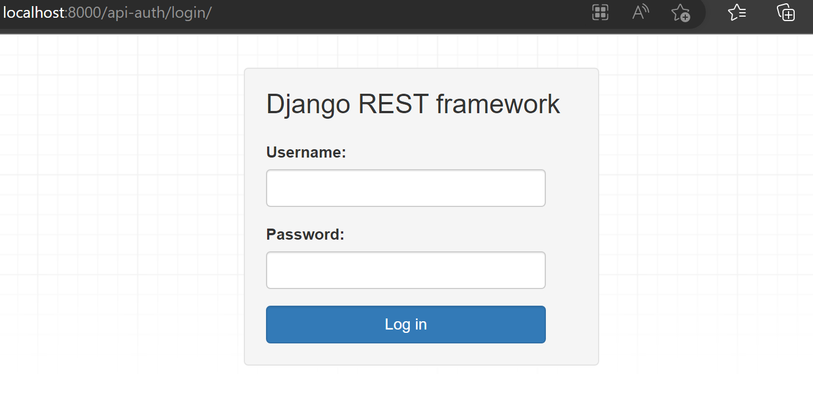

# Django REST Framework - 01

멀티플랫폼에 대응해야하는 필요성이 점점 증가함에 따라, REST방식이 도입되게 되었다.

장고에서는 DRF( Django Rest Framework)가 이를 지원한다.


## REST(Representational State Transfer)의 특징

> 1. Using HTTP protocol - 기존에 웹에서 가장 많이 사용하는 프로토콜을 사용한다.
>
> 2. Convenient resource management - 자원관리가 편리해야 한다.
> 3. Platform independent - 플랫폼에 종속되지 않아야한다.


## 메소드 별 URL의 예

<span style="color: #d86400">Profile</span> List 		 `<protocol>://<HOST domain>/api/v1/profiles` 						   HTTP  <span style="color: #83d80f">GET</span>

<span style="color: #d86400">Profile</span> CREATE  `<protocol>://<HOST domain>/api/v1/profiles` 							HTTP <span style="color: #447205">POST</span>

<span style="color: #d86400">Profile</span> GET 		`<protocol>://<HOST domain>/api/v1/profiles/<profile_id>`  HTTP  <span style="color: #83d80f">GET</span>

<span style="color: #d86400">Profile</span> UPDATE  `<protocol>://<HOST domain>/api/v1/profiles/<profile_id>`  HTTP <span style="color: #058ddd">PUT/PATCH</span>

<span style="color: #d86400">Profile</span> DELETE	`<protocol>://<HOST domain>/api/v1/profiles/<profile_id>`  HTTP <span style="color: #c90e1b">DELETE</span>


#### EXAMPLE - pk 값이 632인 유저의 프로필정보 요청

<span style="color: #d86400">Profile</span> GET		  `HTTP://<HOST domain>/api/v1/profiles/632` 									HTTP  <span style="color: #83d80f">GET</span>

#### Response Json - 

```py
{
    "id": "632",
    "image": "test_image_5232.jpg",
    "nickname": "HELLO_WORLD!"
}
```


## 세팅

##### 설치

`$ pip install djangorestframework markdown`


##### settings.py

```python
INSTALLED_APPS = [
    ...
    'rest_framework',
]
```


##### urls.py

```python
from django.contrib import admin
from django.urls import path, include

urlpatterns = [
    path("admin/", admin.site.urls),
    path("accounts/", include("accountapp.urls")),
    path("api-auth/", include("rest_framework.urls")),
]
```


##### accounts 앱등록

```python
INSTALLED_APPS = [
    ...
    'rest_framework',
    "accounts",
]
```


##### accounts/urls.py

```python
from django.urls import path
from accounts.views import hello_world, hello_world_drf

urlpatterns = [
    path("hello_world/", hello_world),
    path("hello_world_drf/", hello_world_drf),
]
```


##### accounts/views.py

```python
from django.http import HttpResponse
from django.shortcuts import render
from rest_framework.decorators import api_view
from rest_framework.response import Response
# Create your views here.


# 기존 장고 방식
def hello_world(request):
    return HttpResponse('Hello_world!')


# DRF 방식
@api_view()
def hello_world_drf(request):
    return Response({'message':'Hello_world!'})
```


##### api-auth/login/



##### accounts/hello_world/


##### accounts/hello_world_drf/


django REST Framework - **http://www.django-rest-framework.org**

