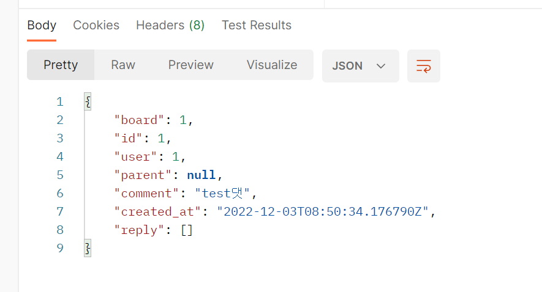
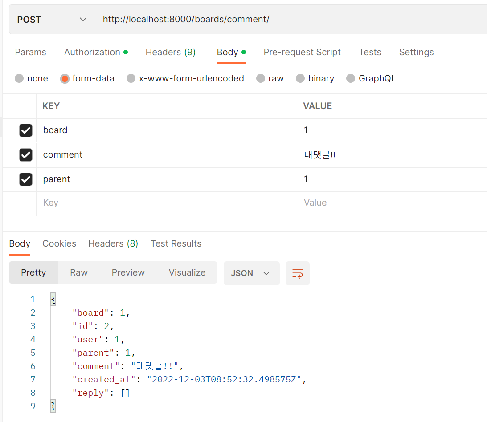

# 🗓️12월 3일 3회차

# 과제 : 게시글 댓글 + 인증/권한 마무리

> 참고자료 : https://velog.io/@lemontech119/DRF%EB%A1%9C-api-%EC%84%9C%EB%B2%84-%EA%B0%9C%EB%B0%9C3-%EB%8C%93%EA%B8%80%EC%9E%91%EC%84%B1

#### 비모강사님의 질문 (vue, drf를 키워드로!)

- 토큰을 발급 받는다. 토큰을 프론트엔드에게 전달한다.
- 프론트엔드는 그 토큰을 어떻게 관리하나?
- 프론트엔드는 그 토큰을 어떻게 서버(백엔드)에게 전달하나?
- 백엔드는 토큰을 받아서 어떻게 사용자를 판단하나?(-> 어떻게 권한처리를 하나?)
- 다음 시간까지 공부해보기!

<br>

## 🧩 댓글 및 대댓글

### 댓글 model 만들기

```python
class Comment(models.Model):
    board = models.ForeignKey(Board, related_name='comments', on_delete=models.CASCADE)
    user = models.ForeignKey(User, related_name='comments', on_delete=models.CASCADE)
    parent = models.ForeignKey('self', related_name='reply', on_delete=models.CASCADE, null=True, blank=True)
    comment = models.CharField(max_length=100)
    created_at = models.DateTimeField('생성시간', auto_now_add=True)
```

> parent는 대댓글 작업을 위해 추가된 컬럼

<br>

### 댓글 serializer 만들기

```python
class CommentSerializer(serializers.ModelSerializer):
    reply = serializers.SerializerMethodField()

    class Meta:
        model = Comment
        fields = ('board', 'id', 'user', 'parent', 'comment', 'created_at','reply')
        read_only_fields = ['user']

    def get_reply(self, instance):
        serializer = self.__class__(instance.reply, many=True)
        serializer.bind('', self)
        return serializer.data
```

> reply는 대댓글이 있을 경우 대댓글 데이터를 볼 수 있도록 추가
>
> SerializerMethodField : **read-only field**로 조회할때만 사용

<br>

### 댓글 view 만들기

```python
class CommentViewSet(viewsets.ModelViewSet):
    queryset = Comment.objects.all()
    serializer_class = CommentSerializer
    permission_classes = [permissions.IsAuthenticatedOrReadOnly]

    def perform_create(self, serializer):
        return serializer.save(user=self.request.user)
```

> perform_creeate 함수를 생성해서 user값을 받아옴
>
> permisson_class로는 **IsAuthenticatedOrReadOnly**를 사용

#### ❗DRF에서 제공하는 permission_class

1. AllowAny: 인증/비인증 모두 허용 (default)
2. IsAuthenticated: 인증된 요청에 대해서만 view 호출
3. IsAdminUser: Staff User에 대해서만 요청 허용 (User.is_staff가 True여야 함)
4. IsAuthenticatedOrReadOnly: 비인증 요청에 대해서는 읽기만 허용
5. DjangoModelPermissions: 사용자 인증과 관련 모델 권한이 할당된 경우 허용 (django.contrib.auth 모델 permission과 관련 있음)
6. DjangoModelPermissionOrAnonReadonly: DjangoModelPermission과 유사, 비인증 요청에 대해서는 읽기만 허용
7. DjangoObjectPermissions: 모델에 대한 객체 별로 권한이 할당된 경우 허용
8. Custom Permission: 개발자가 custom 하게 permission을 만들어서 사용할 수도 있음

<br>

### 댓글 urls 추가

```python
router.register(r'comment', views.CommentViewSet)
```

<br>

### 댓글 및 대댓글 확인



http://localhost:8000/boards/comment/ 에서 board에는 게시글 pk, comment에 댓글 내용을 쓰고 POST 요청 보내면 특정 게시글에 대한 댓글 작성 가능



대댓글은 board는 그대로, comment에는 대댓글을 달 내용, parent에는 어떤 댓글에 답글을 달 것인지 이므로, 댓글의 id를 넣어줌

<br>


