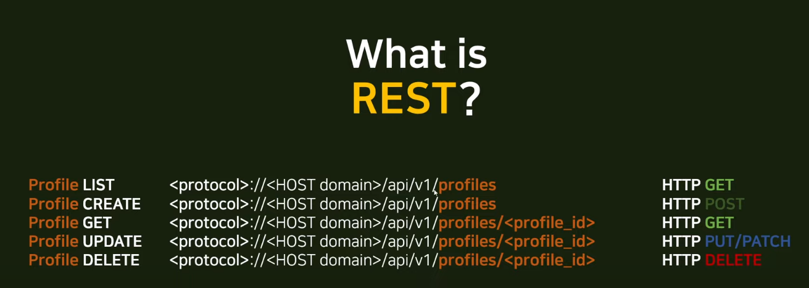
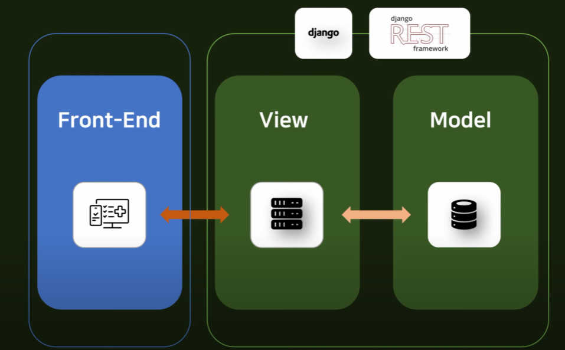
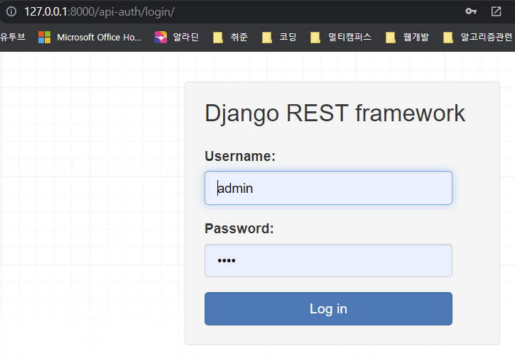
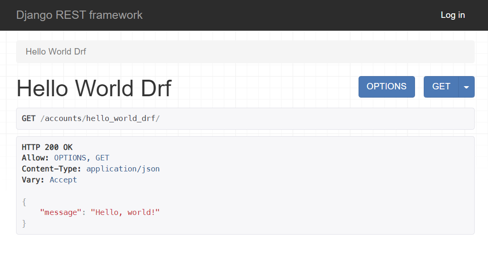
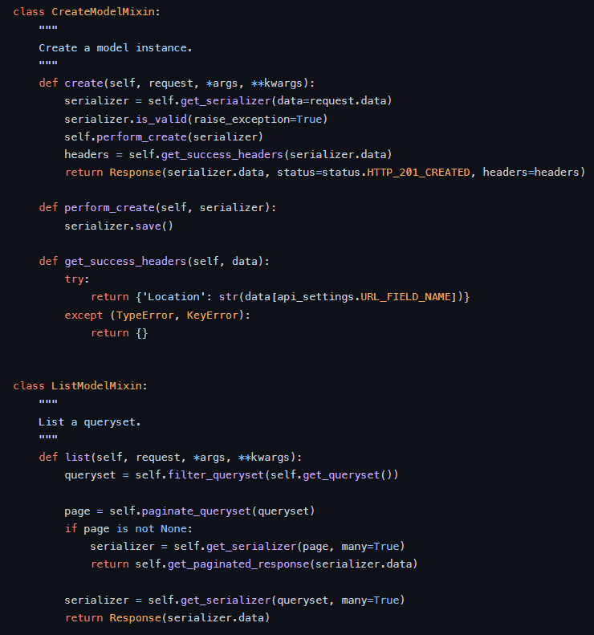
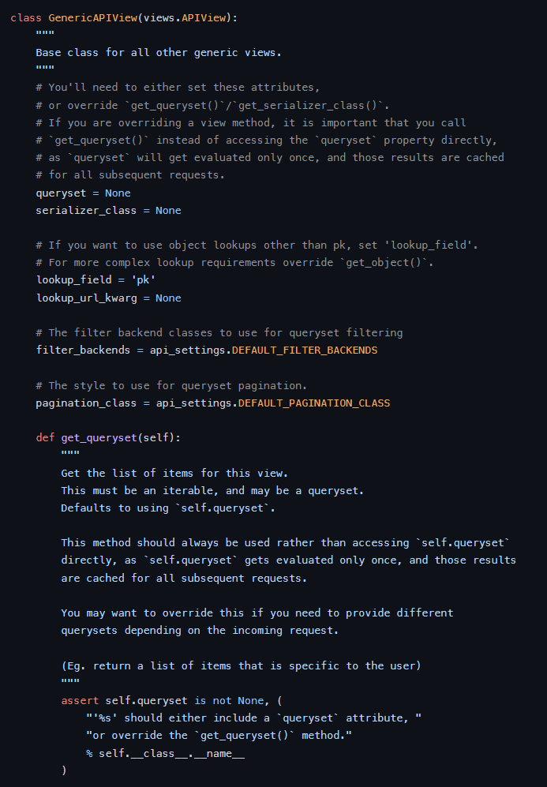
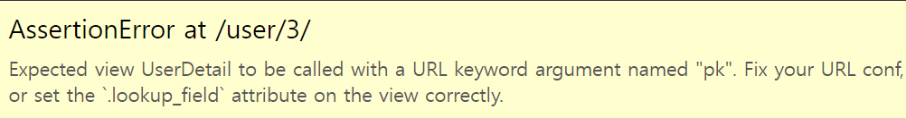
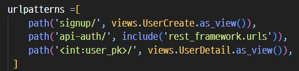
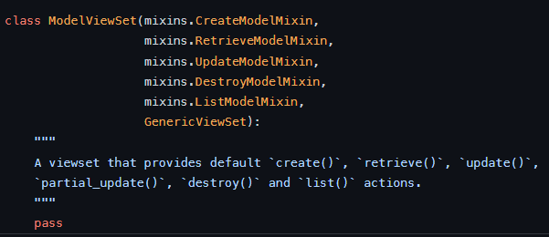
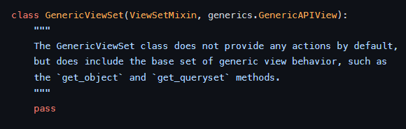

# 🗓️11월 24일 1회차

## 🧩왜 REST 방식의 서버를 구축해야하는지

장고, 스프링과 같은 **웹 프레임워크**는 브라우저(크롬, 파이어폭스, 사파리)로 접속하는 **웹사이트**를 만드는 것에 최적화

시간이 지나고 모바일 어플리케이션이 발달되면서 데스크탑 뿐 아니라 스마트폰, 태블릿 환경도 늘어남

스마트폰에서는 웹사이트를 통한 접근도 중요하지만 **어플리케이션**에 대한 접근도 중요해짐

👉 여러가지 클라이언트들의 사용 방식, 사용 경험 자체가 다변화되면서 **멀티플랫폼 대응**에 대한 중요성이 굉장히 높아짐

그런데 멀티플랫폼 대응이 장고 하나로는 힘듦

이전에는 프론트엔드를 html, css, js로 유저 인터페이스를 구현

> 데스크탑 뿐 아니라 모바일까지 아우르기 위해 REST를 사용한다!

<br>

## 🧩REST란 무엇일까?

1. HTTP 프로토콜을 사용한다.
2. 자원 관리가 편하다.(게시글, 유저 데이터 등)
3. 플랫폼에 독립적이어야 한다.(종속적 X)



기존 장고에서 사용할 때는 Model과 Template이 연결돼있었음, 분리가 안 됨

웹만 만든다면 상관없지만, 유저가 탬플릿에 접근할때 모바일로 접근한다면 기존 Django로는 대응이 어렵다.

#### ❓분리가 안 된다?

프론트와 협업 시 프론트가 React를 쓰려고 한다면 데이터를 기존의 쿼리셋으로 주면 안되고 JSON으로 줘야함

이전에는 백엔드에서 보낸 정보를 프론트에서 받을 때

`` 이런식으로 사용했는데

문제는 이는 HTML, JS가 아닌 **DTL**이다.

즉, 프론트도 정보를 받기 위해 Django를 어느정도 알아야 하거나 백엔드가 프론트를 대신해서 이 문법 정도는 써놔야 할 수 있다.

이렇게 되면, 에러 발생 시 서로 끊임없이 연락하고 코드를 합치고 고치는 일이 잦아지면서 개발 속도가 느려질 것!

> 작업의 효율성을 높이기 위해서는 프론트와 백이 완전히 구별이 되는 것이 이상적



참고자료: https://medium.com/@whj2013123218/django-rest-api%EC%9D%98-%ED%95%84%EC%9A%94%EC%84%B1%EA%B3%BC-%EA%B0%84%EB%8B%A8%ED%95%9C-%EC%82%AC%EC%9A%A9-%EB%B0%A9%EB%B2%95-a95c6dd195fd

<br>

## 🧩DRF 사용법

> 공식문서: https://www.django-rest-framework.org/

### ✔️초기 세팅

필요한 라이브러리 설치

```python
pip install djangorestframework
pip install markdown # browsable API 도와주는 라이브러리
```

settings에 app 추가

```python
INSTALLED_APPS = [
    ...
    'rest_framework',
]
```

로그인, 로그아웃 view도 필요하니까 프로젝트의 urls.py에 추가

```python
urlpatterns = [
    ...
    path('api-auth/', include('rest_framework.urls'))
]
```

api-auth의 login으로 들어가보면?



> DRF에서 제공해주는 로그인 페이지 나옴!

<br>

### ✔️accounts

accounts 앱 하나 만들고 root urls.py와 accounts의 urls.py 관리

```python
urlpatterns = [
    ...
    path('accounts/', include('accounts.urls')),
]
```

기존방식 작성법 vs DRF 작성법

```python
from django.shortcuts import render
from django.http import HttpResponse
from rest_framework.response import Response
from rest_framework.decorators import api_view

# 기존 장고 방식; 함수
def hello_world(request):
    return HttpResponse('Hello, world!')

# DRF 방식
@api_view()
def hello_world_drf(request):
    return Response({"message": "Hello, world!"})
```

> rest_framework의 **Response**를 사용하고 **json** 형식으로 값을 보내줌
>
> 내장 데코레이터인 **api_view()**도 사용



> hello_world_drf url로 들어오게 되면 위와 같은 사이트 화면이 나옴
>
> 따로 디자인을 만들어 놓지 않았어도 이렇게 자동으로 뜸 👉browsable API

<br>

## 🧩CRUD 구현 방법

여러가지가 존재

> APIView, Mixins, Generic CBV, ViewSet 등

### ⭐APIView

#### ❓Serializer란

기존 Django에서 흔하게 활용되는 **Form**과 매우 유사한 개념

둘 다 모두 유효성 검사를 거쳐서 model로부터 field를 읽어오는데

Form은 HTML form을 생성하는 것에 반해, Serializer는 **JSON** 문자열을 생성

<br>

#### ✔️특징

원하는 HTTP method를 **커스터마이징**할 수 있지만

그만큼 코드가 더 길어지고, 번거로워질 수 있음

> https://www.django-rest-framework.org/tutorial/3-class-based-views/

<br>

#### ✔️기본 코드

```python
class Class_name(APIView):
	def method_name(self, request, format=None):
    	# 해당 HTTP method를 어떻게 동작시키고 처리할지 개발자가 정의!
```

<br>

#### ✔️serializer.py

주어진 데이터를 직렬화하는 역할

```python
from .models import Blog
from rest_framework import serializers

class BlogSerializer(serializers.ModelSerializer):
    class Meta:
        model = Blog
        fields = '__all__'
```

<br>

#### ✔️views.py

Blog를 예시로 들어서, 전체 목록을 보여주는 **BlogList** 클래스와, 각 게시글을 보여주는 **BlogDetail** 클래스 2개를 선언

```python
# 데이터 처리
from .models import Blog
from .serializers import BlogSerializer

# APIView를 사용하기 위해 import
from rest_framework.views import APIView
from rest_framework.response import Response
from rest_framework import status
from django.http import Http404

# Blog의 목록을 보여주는 역할
class BlogList(APIView):
    # Blog list를 보여줄 때
    def get(self, request):
        blogs = Blog.objects.all()
        # 여러 개의 객체를 serialization하기 위해 many=True로 설정
        serializer = BlogSerializer(blogs, many=True)
        return Response(serializer.data)

    # 새로운 Blog 글을 작성할 때
    def post(self, request):
        # request.data는 사용자의 입력 데이터
        serializer = BlogSerializer(data=request.data)
        if serializer.is_valid(): #유효성 검사
            serializer.save() # 저장
            return Response(serializer.data, status=status.HTTP_201_CREATED)
        return Response(serializer.errors, status=status.HTTP_400_BAD_REQUEST)

# Blog의 detail을 보여주는 역할
class BlogDetail(APIView):
    # Blog 객체 가져오기
    def get_object(self, pk):
        try:
            return Blog.objects.get(pk=pk)
        except Blog.DoesNotExist:
            raise Http404
    
    # Blog의 detail 보기
    def get(self, request, pk, format=None):
        blog = self.get_object(pk)
        serializer = BlogSerializer(blog)
        return Response(serializer.data)

    # Blog 수정하기
    def put(self, request, pk, format=None):
        blog = self.get_object(pk)
        serializer = BlogSerializer(blog, data=request.data) 
        if serializer.is_valid():
            serializer.save()
            return Response(serializer.data) 
        return Response(serializer.errors, status=status.HTTP_400_BAD_REQUEST)

    # Blog 삭제하기
    def delete(self, request, pk, format=None):
        blog = self.get_object(pk)
        blog.delete()
        return Response(status=status.HTTP_204_NO_CONTENT)  
```

> BlogList는 전체 목록 보여주기(GET)과 새 블로그 객체 등록(POST) 사용
>
> BlogDetail은 각 객체의 detail 보여주기(GET), 객체 수정하기(PUT), 객체 삭제하기(DELETE) 사용

#### ✔️urls.py

```python
from django.urls import path
from rest_framework.urlpatterns import format_suffix_patterns
from . import views

urlpatterns =[
    path('blog/', views.BlogList.as_view()),
    path('blog/<int:pk>/', views.BlogDetail.as_view()),
]

urlpatterns = format_suffix_patterns(urlpatterns)
```

```python
from django.contrib import admin
from django.urls import path, include
from project import urls

urlpatterns = [
    path('admin/', admin.site.urls),
    path('', include('project.urls')),
]
```

<br>

### ⭐Mixins

#### ✔️특징

APIView와의 가장 큰 차이점은 **불필요한 코드의 중복**을 얼마나 줄일 수 있는가

**CBV(Class Based View)**의 **상속**을 활용해서 좀 더 간단하게 구현이 가능

> https://www.django-rest-framework.org/tutorial/3-class-based-views/#using-mixins

<br>

#### ✔️views.py

```python
from .models import Blog
from .serializers import BlogSerializer
from rest_framework import generics
from rest_framework import mixins

# Blog의 목록을 보여주는 역할
class BlogList(mixins.ListModelMixin, 
                  mixins.CreateModelMixin, 
                  generics.GenericAPIView):
    queryset = Blog.objects.all()
    serializer_class =BlogSerializer

	# Blog list를 보여줄 때
    def get(self, request, *args, **kwargs):
        return self.list(request, *args, **kwargs)
	
	# 새로운 Blog 글을 작성할 때
    def post(self, request, *args, **kwargs):
        return self.create(request, *args, **kwargs)

# Blog의 detail을 보여주는 역할
class BlogDetail(mixins.RetrieveModelMixin,
                     mixins.UpdateModelMixin,
                     mixins.DestroyModelMixin,
                     generics.GenericAPIView):
    queryset = Blog.objects.all()
    serializer_class = BlogSerializer

	# Blog의 detail 보기
    def get(self, request, *args, **kwargs):
        return self.retrieve(request, *args, **kwargs)

	# Blog 수정하기
    def put(self, request, *args, **kwargs):
        return self.update(request, *args, **kwargs)

	# Blog 삭제하기
    def delete(self, request, *args, **kwargs):
        return self.destroy(request, *args, **kwargs)
```

> BlogList, BlogDetail 클래스를 살펴보면, 인자로 mixins.ListModelMixin, mixins.CreateModelMixin 등을 받음
>
> drf 공식 github의 mixins.py 코드를 보면
>
> https://github.com/encode/django-rest-framework/blob/master/rest_framework/mixins.py
>
> 
>
> 이런식으로 미리 정의가 돼있음 👉 상속을 통해 편하게 활용
>
> queryset과 serializer_class 역시 인자로 상속받은 generics.GenericAPIView에서 찾아볼 수 있음
>
> https://github.com/encode/django-rest-framework/blob/master/rest_framework/generics.py
>
> 
>
> 클래스 상속 후 queryset과 serializer_class가 None으로 설정돼있는데
>
> 이를 채워준다는 개념!

<br>

### ⭐Generic CBV

#### ✔️특징

mixins보다 코드 중복을 더 줄일 수 있음

> https://www.django-rest-framework.org/tutorial/3-class-based-views/#using-generic-class-based-views

mixins에서는 generics.py의 **GenericAPIView**를 상속받았는데

Generic CBV에서는 다른 클래스를 상속받음

<br>

#### ✔️views.py

```python
from .models import Blog
from .serializers import BlogSerializer
from rest_framework import generics

# Blog의 목록을 보여주는 역할
class BlogList(generics.ListCreateAPIView):
    queryset = Blog.objects.all()
    serializer_class = BlogSerializer

# Blog의 detail을 보여주는 역할
class BlogDetail(generics.RetrieveUpdateDestroyAPIView):
    queryset = Blog.objects.all()
    serializer_class = BlogSerializer
```

> APIView는 여러 조합으로 이루어져있음
>
> ListAPIView는 객체의 전체 목록을 보여주는 GET
>
> ListCreateAPIView는 객체 전체 목록 보기 + 새로운 객체 등록 이런식의 조합이 가능
>
> 추가로 generics.py에서 사용한 클래스(ex. ListAPIView)에서는 **GenericAPIView**를 다시 상속받고 있기 때문에
>
> Generic CBV에서도 queryset과 serializer_class를 별도로 지정!

<br>

#### ❗Detail 부분

```python
# 회원가입
class UserCreate(generics.CreateAPIView):
    queryset = User.objects.all()
    serializer_class = UserSerializer

# 유저 디테일 보기
class UserDetail(generics.RetrieveUpdateDestroyAPIView):
    queryset = User.objects.all()
    serializer_class = UserSerializer
    lookup_field = 'pk'
    lookup_url_kwargs = None
```

> User모델의 회원가입과 detail(회원 정보)을 Generic-CBV로 구현했는데, 계속 에러가 떴음
>
> 
>
> 👉url에서 pk값을 제대로 설정을 안해줘서 그럼
>
> 
>
> user_pk가 아니고 **pk**로 써야 에러가 안 남!

<br>

### ⭐ViewSets

#### ✔️특징

상속을 여러번 거친만큼 코드가 매우 간결

> https://www.django-rest-framework.org/tutorial/6-viewsets-and-routers/

<br>

#### ✔️views.py

```python
from .models import Blog
from .serializers import BlogSerializer
from rest_framework import viewsets

# Blog의 목록, detail 보여주기, 수정하기, 삭제하기 모두 가능
class BlogViewSet(viewsets.ModelViewSet):
    queryset = Blog.objects.all()
    serializer_class = BlogSerializer
```

> 
>
> ModelViewSet안에 이전에 사용했던 mixins와 GenericViewSet를 상속 받고 있고,
>
> 
>
> GenericViewSet은 또 generics의 GenericAPIView를 상속받고 있음

<br>

#### ✔️urls.py

ViewSet의 경우에는 하나의 class에 Blog 목록과 detail을 보여주는 기능이 모두 존재하는데 하나의 path 함수로는 표현할 수 없음!

왜냐하면 Blog 목록을 보여주는 url의 경우에는 pk 값이 필요가 없지만, detail을 보여주기 위해서는 pk 값이 반드시 필요하기 때문

> ViewSet을 사용하기 위해서는 **서로 다른 path 함수를 하나로 묶어주는 과정**이 필요하고
>
> 두가지 방법이 존재

##### 1. as_view() 함수

함수의 인자로는 http method와 처리할 함수의 이름을 작성

처리할 함수의 이름은 list, create, retrieve, update, destory 등

```python
from django.urls import path
from .views import BlogViewSet

# Blog 목록 보여주기
blog_list = BlogViewSet.as_view({
    'get': 'list',
    'post': 'create'
})

# Blog detail 보여주기 + 수정 + 삭제
blog_detail = BlogViewSet.as_view({
    'get': 'retrieve',
    'put': 'update',
    'delete': 'destroy'
})

urlpatterns =[
    path('blog/', blog_list),
    path('blog/<int:pk>/', blog_detail),
]
```

<br>

##### 2. router 활용하기

rest framework의 DefaultRouter라는 객체를 생성하여, mapping 하고자 하는 view를 등록

```python
from django.urls import path, include
from .views import BlogViewSet
from rest_framework.routers import DefaultRouter

router = DefaultRouter()
# 첫 번째 인자는 url의 prefix
# 두 번째 인자는 ViewSet
router.register('blog', BlogViewSet)

urlpatterns =[
    path('', include(router.urls))
]
```


